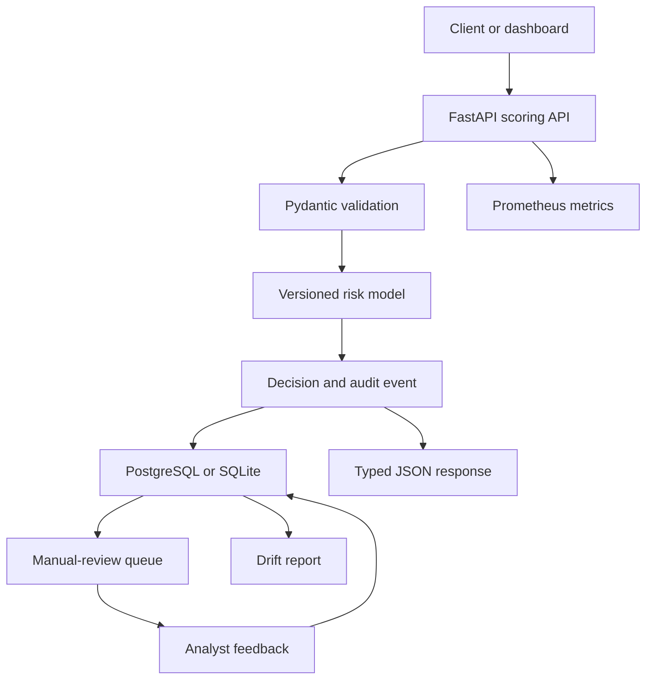

# RiskPulse

RiskPulse is a production-minded real-time transaction risk scoring service. It
combines a calibrated fraud model with a typed FastAPI backend, strict artifact
validation, automated tests, containerization, and CI.

The API keeps the original deterministic demo endpoint and can also serve the
calibrated model trained on a documented public fraud dataset. Its metrics are
development metrics, not claims about real-world fraud performance.

## Current capabilities

- Train and serialize a reproducible logistic-regression baseline
- Validate transaction inputs with Pydantic
- Return risk scores, decisions, and stable reason codes
- Expose liveness, readiness, and model-metadata endpoints
- Generate interactive OpenAPI documentation
- Run locally or in Docker
- Enforce linting, formatting, tests, and coverage in GitHub Actions
- Load and validate OpenML credit-card fraud dataset 1597
- Preserve chronology with a 70/15/15 train/validation/test split
- Tune alert thresholds against explicit fraud-loss and review-cost assumptions
- Calibrate fraud probabilities on a dedicated chronological period
- Serve the versioned real-data artifact behind a typed scoring contract
- Fail gracefully when the optional calibrated artifact is unavailable
- Persist scoring events and review feedback through SQLAlchemy
- Protect scoring writes with payload-aware idempotency keys
- Manage the database schema with Alembic migrations
- Run PostgreSQL alongside the API with Docker Compose
- Export bounded-cardinality HTTP and model metrics for Prometheus
- Detect feature and prediction drift against a versioned training reference
- Propagate request IDs and emit structured request-completion logs
- Explore scoring activity, model drift, and analyst reviews in an interactive dashboard

## Architecture



## Operations dashboard

The [`dashboard/`](dashboard/) workspace provides the analyst-facing RiskPulse
interface. It includes scoring and alert KPIs, a transaction-volume chart,
PSI drift monitoring, a searchable manual-review queue, transaction details,
and interactive review outcomes.

The hosted build currently uses an explicitly labelled demo stream so the
interface can be evaluated without a running API. The next integration step is
to connect the same screens to the RiskPulse scoring, review, metrics, and drift
endpoints.

Run it locally:

```bash
cd dashboard
npm run install:ci
npm run dev
```

## Quick start

Requirements: Python 3.12 or newer.

```bash
python3 -m venv .venv
source .venv/bin/activate
python -m pip install --upgrade pip
python -m pip install -e ".[dev]"
python -m riskpulse.ml.train --output artifacts/fraud_model.joblib
make calibrate
make monitoring-reference
make migrate
python -m uvicorn riskpulse.main:app --app-dir src --reload
```

Open:

- API documentation: `http://127.0.0.1:8000/docs`
- Readiness check: `http://127.0.0.1:8000/health/ready`
- Demo model metadata: `http://127.0.0.1:8000/v1/model`
- Calibrated model metadata: `http://127.0.0.1:8000/v1/credit-card/model`
- Prometheus metrics: `http://127.0.0.1:8000/metrics`
- Drift report: `http://127.0.0.1:8000/v1/monitoring/drift`

Score a transaction:

```bash
curl -X POST "http://127.0.0.1:8000/v1/transactions/score" \
  -H "Content-Type: application/json" \
  -d '{
    "amount": 850.0,
    "account_age_days": 12,
    "hour_of_day": 2,
    "is_international": true,
    "is_new_device": true,
    "failed_attempts_24h": 3,
    "transactions_1h": 9,
    "distance_from_home_km": 620.0
  }'
```

Example response:

```json
{
  "transaction_id": "generated-uuid",
  "risk_score": 0.91,
  "decision": "decline",
  "reasons": [
    "new_device",
    "international_transaction",
    "multiple_failed_attempts",
    "high_transaction_velocity",
    "large_location_change",
    "unusual_transaction_time"
  ],
  "model_version": "baseline-YYYYMMDD-identifier",
  "scored_at": "generated-utc-timestamp"
}
```

Actual values vary with the trained artifact.

The real-data endpoint is available at
`POST /v1/credit-card/transactions/score`. Its request contains the public
dataset's `time`, `amount`, and anonymized `v1` through `v28` PCA features.
Swagger UI provides the complete editable request example. The response returns
a calibrated fraud probability and routes an alert to `manual_review`; it does
not automatically decline a transaction. Clients should send an
`Idempotency-Key` header. Repeating the same key and feature payload returns the
original event, while changing the payload produces HTTP 409.

Local commands default to SQLite at `artifacts/riskpulse.db`, keeping setup
small. Docker Compose runs the same SQLAlchemy repository against PostgreSQL.

## Development commands

```bash
make install
make data
make benchmark
make calibrate
make monitoring-reference
make migrate
make train
make run
make lint
make test
make check
```

`make benchmark` fits a dummy reference, class-weighted logistic regression,
and histogram gradient boosting. Models and thresholds are selected using only
the validation period. The selected pair is then evaluated once on the
untouched test period. The report is written to
`artifacts/real_data_benchmark.json`.

`make calibrate` keeps four chronological periods separate: model fitting,
probability calibration, threshold selection, and final testing. It writes a
versioned Joblib model, a machine-readable evaluation report, and a
recruiter-readable model card under `artifacts/`.

`make monitoring-reference` scores the chronological training period with the
selected calibrated artifact and stores decile distributions for all 30 input
features plus the model output. The runtime drift endpoint compares recent,
persisted scoring events with this versioned reference using Population
Stability Index (PSI). The report stays `insufficient_data` until the configured
minimum sample size is reached, warns at PSI 0.10, and becomes critical at PSI
0.25 by default.

For PostgreSQL and the API in Docker:

```bash
docker compose up --build
```

Compose starts PostgreSQL, waits for its health check, applies the Alembic
migration, mounts the locally generated calibrated Joblib artifact read-only,
and then starts the API as a non-root user. It also starts Prometheus at
`http://127.0.0.1:9090` and scrapes the API every 15 seconds. Run
`make calibrate` and `make monitoring-reference` before the first Compose
startup so that both read-only artifacts exist.

## API surface

| Method | Endpoint | Purpose |
| --- | --- | --- |
| `GET` | `/health/live` | Confirm that the service process is running |
| `GET` | `/health/ready` | Confirm that the model is loaded |
| `GET` | `/v1/model` | Inspect model version, features, and metrics |
| `POST` | `/v1/transactions/score` | Score one demo-schema transaction |
| `GET` | `/v1/credit-card/model` | Inspect the calibrated artifact contract |
| `POST` | `/v1/credit-card/transactions/score` | Score anonymized public-data features |
| `GET` | `/v1/credit-card/transactions/{id}` | Retrieve an immutable scoring audit event |
| `GET` | `/v1/credit-card/reviews` | List unresolved manual-review events |
| `POST` | `/v1/credit-card/transactions/{id}/feedback` | Record an analyst outcome |
| `GET` | `/v1/monitoring/drift` | Compare recent traffic with the training reference |
| `GET` | `/metrics` | Export Prometheus latency, traffic, scoring, and feedback metrics |

## Important modelling choices

- Inputs contain only information assumed to be available at authorization
  time, reducing leakage risk.
- Accuracy is intentionally not the headline metric. The training pipeline
  records ROC-AUC, PR-AUC, precision, and recall.
- Candidate models address the severe class imbalance through weighting or
  nonlinear learning, then calibrate the selected model on a separate period.
- Cost-sensitive threshold selection charges a configurable fixed review cost
  for false alerts and the transaction amount for missed fraud. These are
  transparent modelling assumptions, not claimed production costs.
- Model artifacts carry their version, training timestamp, feature schema, and
  validation metrics.
- The service rejects artifacts whose feature order no longer matches the API.
- Joblib artifacts can execute code while loading, so the service accepts only
  artifacts produced by a trusted training pipeline.
- Feature payloads are anonymized PCA values from the public dataset. A
  production deployment should apply its own retention and access policies.
- The feedback endpoint intentionally has no authentication in this portfolio
  build; authentication and role-based authorization are required before use
  with real analysts.
- PSI is an unsupervised shift signal, not proof of degraded fraud performance.
  Investigation and labelled feedback are required before retraining or
  promoting another model.
- Prometheus labels use route templates and controlled model fields to avoid
  transaction-level cardinality.
- Reason codes describe triggered business signals. They are not presented as
  causal explanations.

## Roadmap

### Phase 2 — Real data and stronger evaluation

- [x] Integrate a documented public fraud dataset
- [x] Build time-aware preprocessing and a temporal validation split
- [x] Compare interpretable and nonlinear baselines
- [x] Add cost-sensitive threshold selection
- [x] Add probability calibration and a model card
- [x] Produce a model card and reproducible evaluation report

### Phase 3 — Real-model serving

- [x] Load and validate the versioned calibrated artifact
- [x] Expose typed scoring and metadata endpoints
- [x] Route model alerts to manual review
- [x] Keep the demo service healthy when the optional artifact is absent

### Phase 4 — Production data layer

- [x] Persist scoring events and review feedback in PostgreSQL
- [x] Add Alembic schema migrations
- [x] Add payload-aware idempotency keys
- [x] Add an auditable manual-review queue
- Add Redis-backed online features
- Add batch scoring
- [x] Introduce structured request logs and request-ID tracing

### Phase 5 — MLOps and monitoring

- Track experiments and artifacts with MLflow
- [x] Export Prometheus latency, throughput, and model-output metrics
- [x] Detect feature and prediction drift against a versioned reference
- Add champion/challenger promotion and rollback

### Phase 6 — Product experience

- [x] Build a responsive operations dashboard
- Replay transactions as an event stream
- [x] Add a demo human-review queue and feedback workflow
- Deploy a public demo and publish measured load-test results

## Project structure

```text
dashboard/             # Analyst operations dashboard
src/riskpulse/
├── api/          # FastAPI routes and dependencies
├── domain/       # Request, response, and decision models
├── ml/           # Features, training, artifacts, and inference
├── persistence/  # SQLAlchemy models, sessions, and audit repository
├── config.py     # Environment-based configuration
└── main.py       # Application factory
```

## License

MIT
