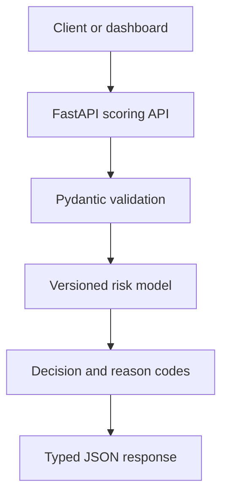

# RiskPulse

RiskPulse is a production-minded real-time transaction risk scoring service. It
combines an interpretable machine-learning baseline with a typed FastAPI
backend, automated tests, containerization, and CI.

This repository is currently Phase 1 of a larger portfolio project. The model
uses deterministic synthetic data so anyone can reproduce the complete system
without downloading private or restricted financial data. Its metrics are
development metrics, not claims about real-world fraud performance.

## Current capabilities

- Train and serialize a reproducible logistic-regression baseline
- Validate transaction inputs with Pydantic
- Return risk scores, decisions, and stable reason codes
- Expose liveness, readiness, and model-metadata endpoints
- Generate interactive OpenAPI documentation
- Run locally or in Docker
- Enforce linting, formatting, tests, and coverage in GitHub Actions

## Architecture



## Quick start

Requirements: Python 3.12 or newer.

```bash
python3 -m venv .venv
source .venv/bin/activate
python -m pip install --upgrade pip
python -m pip install -e ".[dev]"
python -m riskpulse.ml.train --output artifacts/fraud_model.joblib
python -m uvicorn riskpulse.main:app --app-dir src --reload
```

Open:

- API documentation: `http://127.0.0.1:8000/docs`
- Readiness check: `http://127.0.0.1:8000/health/ready`
- Model metadata: `http://127.0.0.1:8000/v1/model`

Score a transaction:

```bash
curl -X POST "http://127.0.0.1:8000/v1/transactions/score" \
  -H "Content-Type: application/json" \
  -d '{
    "amount": 850.0,
    "account_age_days": 12,
    "hour_of_day": 2,
    "is_international": true,
    "is_new_device": true,
    "failed_attempts_24h": 3,
    "transactions_1h": 9,
    "distance_from_home_km": 620.0
  }'
```

Example response:

```json
{
  "transaction_id": "generated-uuid",
  "risk_score": 0.91,
  "decision": "decline",
  "reasons": [
    "new_device",
    "international_transaction",
    "multiple_failed_attempts",
    "high_transaction_velocity",
    "large_location_change",
    "unusual_transaction_time"
  ],
  "model_version": "baseline-YYYYMMDD-identifier",
  "scored_at": "generated-utc-timestamp"
}
```

Actual values vary with the trained artifact.

## Development commands

```bash
make install
make train
make run
make lint
make test
make check
```

For Docker:

```bash
docker compose up --build
```

The image trains a reproducible demo model during the build and runs the API as
a non-root user.

## API surface

| Method | Endpoint | Purpose |
| --- | --- | --- |
| `GET` | `/health/live` | Confirm that the service process is running |
| `GET` | `/health/ready` | Confirm that the model is loaded |
| `GET` | `/v1/model` | Inspect model version, features, and metrics |
| `POST` | `/v1/transactions/score` | Score one transaction |

## Important modelling choices

- Inputs contain only information assumed to be available at authorization
  time, reducing leakage risk.
- Accuracy is intentionally not the headline metric. The training pipeline
  records ROC-AUC, PR-AUC, precision, and recall.
- The baseline uses class weighting so the minority class contributes
  meaningfully during training. Probability calibration remains a Phase 2
  deliverable.
- Model artifacts carry their version, training timestamp, feature schema, and
  validation metrics.
- The service rejects artifacts whose feature order no longer matches the API.
- Reason codes describe triggered business signals. They are not presented as
  causal explanations.

## Roadmap

### Phase 2 — Real data and stronger evaluation

- Integrate a documented public fraud dataset
- Build time-aware preprocessing and a temporal validation split
- Compare logistic regression with LightGBM
- Add probability calibration and cost-sensitive threshold selection
- Produce a model card and reproducible evaluation report

### Phase 3 — Production data layer

- Persist scoring events and review feedback in PostgreSQL
- Add Redis-backed online features
- Add idempotency keys and batch scoring
- Introduce structured logging and request tracing

### Phase 4 — MLOps and monitoring

- Track experiments and artifacts with MLflow
- Export Prometheus latency and throughput metrics
- Detect feature and prediction drift with Evidently
- Add champion/challenger promotion and rollback

### Phase 5 — Product experience

- Build a Next.js operations dashboard
- Replay transactions as an event stream
- Add a human-review queue and feedback workflow
- Deploy a public demo and publish measured load-test results

## Project structure

```text
src/riskpulse/
├── api/          # FastAPI routes and dependencies
├── domain/       # Request, response, and decision models
├── ml/           # Features, training, artifacts, and inference
├── config.py     # Environment-based configuration
└── main.py       # Application factory
```

## License

MIT
